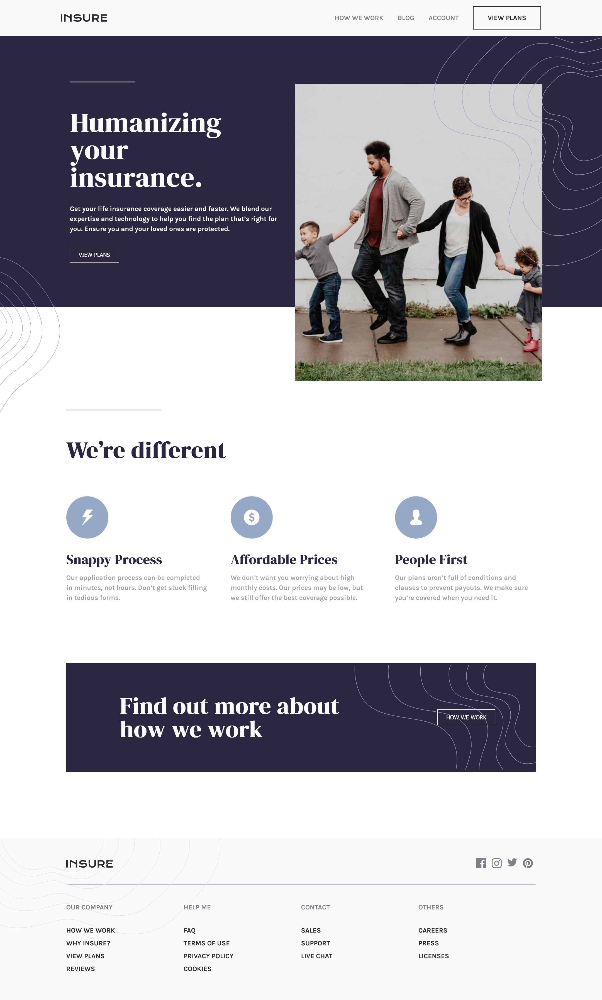

# Frontend Mentor project - Insure Landing Page
[Frontend Mentor](https://www.frontendmentor.io) challenges help me improve my coding skills by building realistic projects.

To completed this project I use React app and sass css. You can see it on desktop width 1440px and for mobile 375px.

- Here is design for desktop from Frontend Mentor:

- This is my screenshot:


All challenge on Gthub pages: https://zalewskaewa7.github.io/insure_landing_page


## Project Setup

```sh
npm install
```

### Compile and Hot-Reload for Development

```sh
npm run dev
```

### Compile and Minify for Production

```sh
npm run build
```
